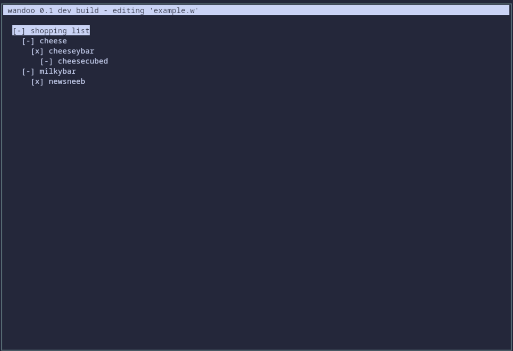

# wandoo

wandoo is a simple and sturdy tree-based todo software in pure C using ncurses. 

its a checklist with n-ary trees. what more could you want? 

technically project management software but its like 600 lines of code..

its pretty simple, that's good. i'm following the unix philosophy.

## contributing

only add pull requests on [codeberg](https://codeberg.org/blobii/wandoo) please, github is a mirror.

if you get a bug please just tell me with a screenshot or logs

## installing

Run `./build.sh` and `build/wandoo <filename>` to build/run. 

## licensing

Licensed under GPLv3 or later. 
